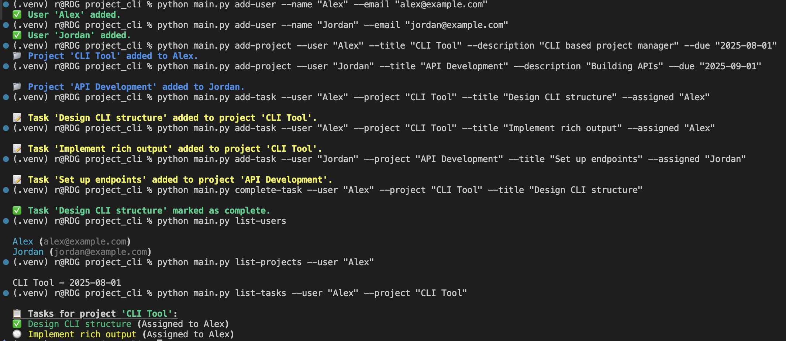

# Project Management CLI Tool

This is a Python-based command-line interface (CLI) tool that helps developers manage users, projects, and tasks from the terminal. It supports multiple users, project assignments, task tracking.

Built it with `argparse`, and `rich` for better CLI visuals. (Data is saved between sessions using JSON)

---

## Table of Contents

- [Demo](#demo)
- [Setup](#setup)
- [Testing](#testing)
- [Features](#features)
- [Dependencies](#-dependencies)
- [Usage Examples](#-usage-examples)
- [Known Issues](#-known-issues)

---

## Demo

Below is a screenshot of the CLI:

---

## Setup

1. Clone the repo and move into the folder
2. Set up virtual environment
python3 -m venv .venv
source .venv/bin/activate
3. Install dependencies
`pip install -r requirements.txt`

---

## Testing
Run all tests using pytest: `pytest tests/`

---

## Features
	•	Add and manage multiple users
	•	Assign projects to users with due dates
	•	Add tasks to projects and assign users
	•	Mark tasks as complete
	•	Colorful terminal output using rich
	•	Unit tests with pytest

---
## Dependencies
	•	rich – for pretty CLI output
	•	pytest – for testing
Install via:
`pip install rich pytest`
`pip freeze > requirements.txt`